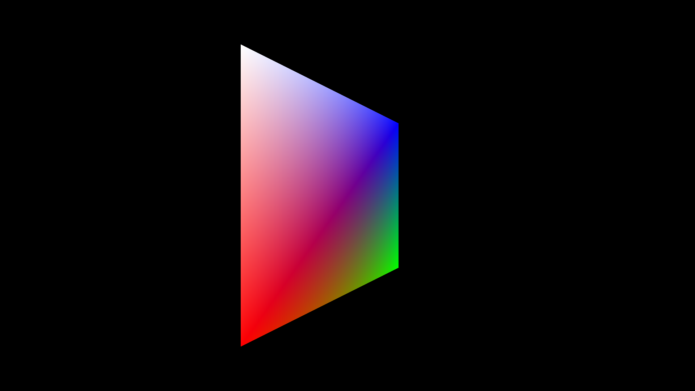

# C-Vulkan

A minimalist C99 vulkan renderer.

## Screenshot

## Features

- dynamic containers ([containers.h](./src/containers.h), [containers.c](./src/containers.c))
- linear algebra ([math.h](./src/math.h), [math.c](./src/math.c))
- fullscreen window using win32
- basic vulkan rendering

## How to build

### Windows

While in project root:

1. run `third-party/premake/premake5.exe vs2022` in terminal
2. open `sadlib.sln` in Visual Studio
3. select config and platform
4. build & run

## License

[MIT License](./LICENSE)
